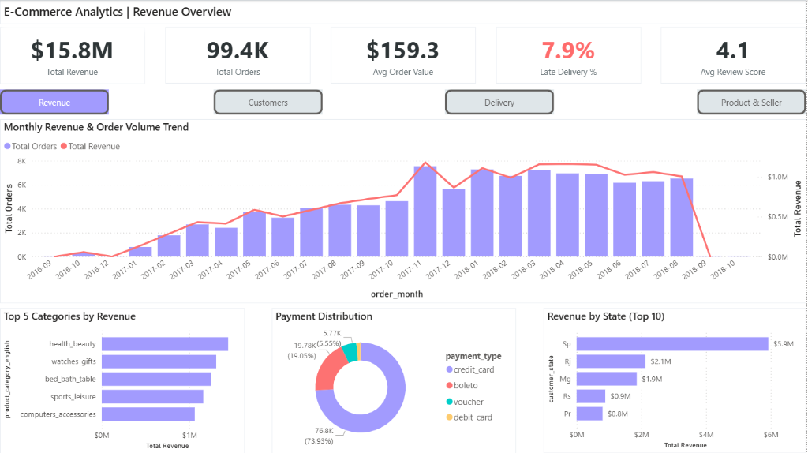
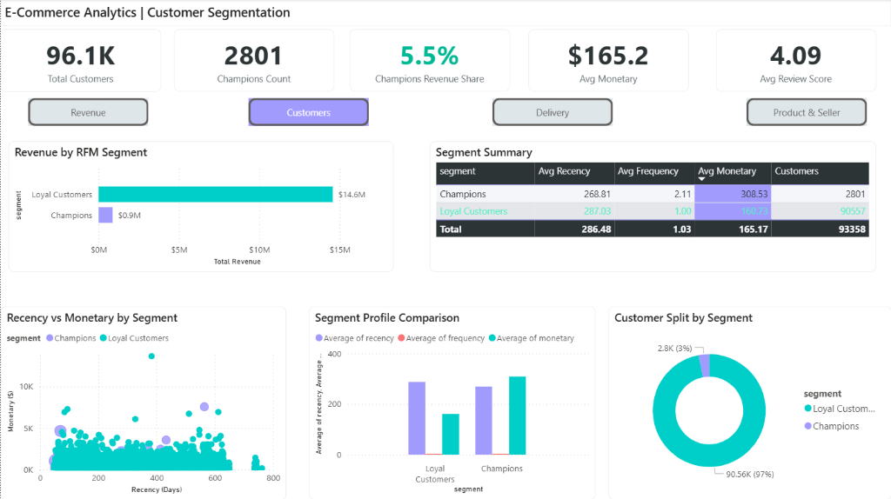
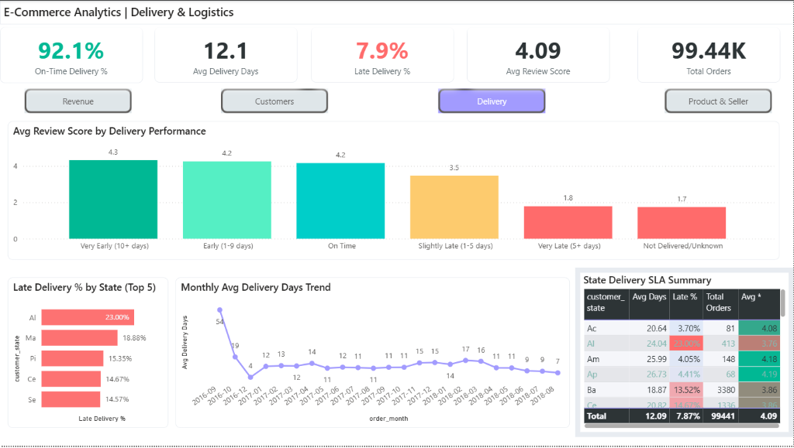
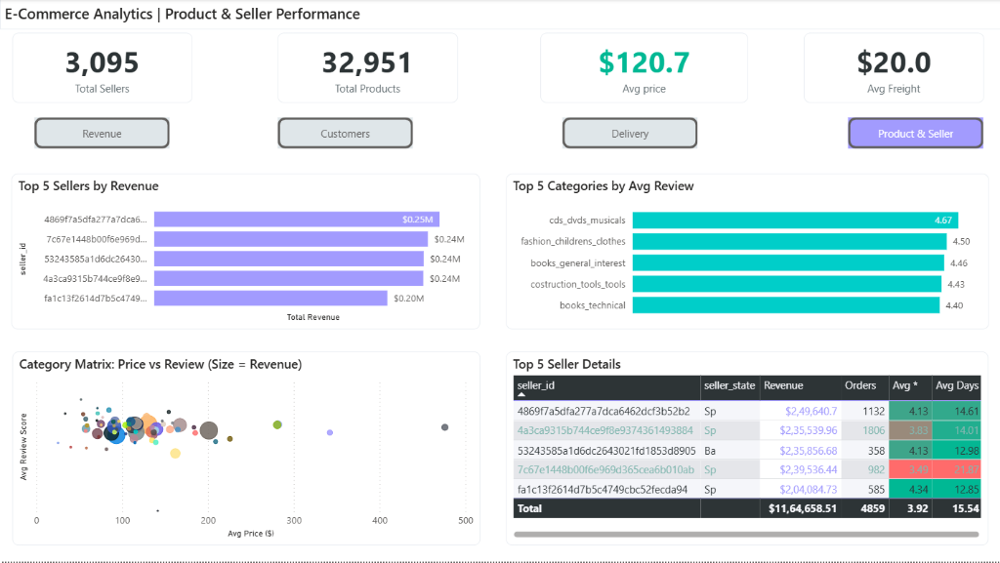

# 🛒 E-Commerce Business Intelligence & Customer Analytics Platform

---

## The Problem Statement
E-commerce marketplaces deal with millions of customers, thousands of sellers, and countless products. It is impossible to manually understand who your best customers are, why some sellers fail, or how logistical delays impact the bottom line. Traditional reporting often looks at raw sales numbers but misses the deeper behavioral patterns. This leaves companies guessing when it comes to segmenting their audience or optimizing their operations.

## Why This Issue Must Be Cured (The Impact)
When e-commerce platforms don't understand their data, they bleed money and lose market share:
- **Wasted Marketing Spend:** Without knowing who your "Champions" are versus your "One-Time Buyers," marketing campaigns are generic and highly inefficient.
- **Logistical Nightmares:** Failing to track delivery SLAs leads to plunging customer satisfaction. We found that late deliveries are the #1 driver of poor reviews, devastating brand reputation.
- **Lost Revenue:** Without identifying the top product categories and reliable sellers, the platform misses out on huge upsell and cross-sell opportunities.

Ultimately, flying blind without a solid Business Intelligence platform costs e-commerce companies millions in missed retention and operational inefficiencies.

## The Solution
I built a completely automated, end-to-end **Business Intelligence and Customer Analytics** platform using data from 100K+ real e-commerce orders on Brazil's Olist marketplace.

Instead of relying solely on basic sales metrics, this system:
1. Automates the ingestion of massive amounts of e-commerce data (orders, items, payments, reviews).
2. Uses advanced **Machine Learning (K-Means Clustering)** and **RFM (Recency, Frequency, Monetary) Analysis** to automatically segment customers into actionable groups.
3. Conducts rigorous **Statistical Correlation Analysis** to quantify exactly how much delivery times impact customer reviews.
4. Feeds these deep insights directly into a sleek, interactive **Power BI Dashboard** so business leaders can track revenue, logistics, and seller performance at a glance.

## Tools Required
To bring this solution to life, I engineered a complete data pipeline utilizing modern analytics infrastructure:

| Technology | Purpose in Project |
| :--- | :--- |
| **Python 3.10+** | **The Analytical Engine:** Used `pandas`, `numpy`, and `scikit-learn` for large-scale Extract, Transform, Load (ETL) processing. Handled automated customer segmentation (K-Means) and deep statistical hypothesis testing (Welch's t-test). |
| **MySQL 8.0** | **The Data Warehouse:** Designed an optimized **Star Schema** with 15 performance indexes. Built out advanced SQL components including CTEs and window functions to handle complex cohort and Pareto analyses efficiently. |
| **Power BI** | **The Operational View:** Developed an interactive, 4-page executive dashboard mapped directly to the database to track real-time KPIs across revenue, customers, and logistics. |
| **Brazilian E-Commerce Dataset** | **The Raw Material:** A Kaggle dataset simulating over 100,000 real orders from the Olist marketplace. |

## Project Structure
```text
ecommerce_bi_project/
├── sql/                               # 6 SQL files
│   ├── 01_schema_design.sql           # Star schema (4 dim + 4 fact, 15 indexes)
│   ├── 03_eda_queries.sql             # 8 baseline KPI queries
│   ├── 04_revenue_analytics.sql       # Waterfall, Pareto, moving avg
│   ├── 05_customer_segmentation.sql   # RFM scoring, cohort retention
│   ├── 06_delivery_logistics.sql      # SLA, delivery-review analysis
│   └── 07_product_seller_analysis.sql # Seller ranking, basket analysis
├── python/                            # 5 Python scripts
│   ├── 01_etl_pipeline.py             # CSV → MySQL ETL pipeline
│   ├── 02_eda_analysis.py             # Baseline exploratory data analysis
│   ├── 03_rfm_segmentation.py         # K-Means clustering + visualization
│   ├── 04_correlation_analysis.py     # Statistical hypothesis testing
│   └── 05_cohort_analysis.py          # Retention heatmaps & curves
├── plots/                             # 20 generated visualizations
├── powerbi/                           # Power BI dashboard (.pbix) + theme JSON
├── docs/                              # Project documentation & screenshots
├── data/
│   ├── raw/                           # Original CSV (not on github)
│   └── processed/                     # Cleaned exports
├── requirements.txt                   # Python dependencies
└── .gitignore
```

## The Final Product: Dashboard Snapshots
The end result is an operational Power BI dashboard made for e-commerce executives and logistics managers.

### Page 1: Revenue Overview
High-level KPIs including total revenue, order volume, average order value, and top performing product categories.



### Page 2: Customer Segmentation
A deep dive into customer behavior, using RFM clustering to identify "Champions" versus "Loyal Customers," driving targeted retention strategies.



### Page 3: Delivery & Logistics
The operational view tracking on-time delivery percentages, average delivery days, and the critical impact of fulfillment speed on customer reviews.



### Page 4: Product & Seller Performance
A granular look at the thousands of sellers on the platform, identifying top performers, analyzing pricing versus reviews, and tracking average freight costs.



## 🔍 Dashboard Observations & Key Findings

Based on the interactive dashboards, several critical insights emerged regarding customer behavior and operational bottlenecks:

1. **The "Champion" Disproportion:** 
   Our RFM segmentation revealed that a tiny fraction of customers (**3%**, labeled as "Champions") drive **over 5.5%** of the total revenue. These users order more frequently (avg 2.11 vs 1.03) and spend nearly double the average monetary value. This indicates a massive opportunity for a VIP loyalty program.
   
2. **Delivery Speed Determines Satisfaction:**
   There is a severe penalty for poor logistics. Customers who receive their packages "Very Early" award an average review score of **4.3**, whereas "Very Late" deliveries drag the score down to a catastrophic **1.8**. Late deliveries sit at 7.9% overall, but certain states like AL (23%) and MA (18.8%) face systemic logistical failures that urgently need supply chain intervention.
   
3. **Revenue Concentration:**
   The revenue heavily concentrates in specific verticals. `health_beauty`, `watches_gifts`, and `bed_bath_table` are the dominant categories. Geographically, São Paulo (SP) alone generated $5.9M, which is nearly equal to the rest of the top 10 states combined, proving it should be the epicenter for any targeted marketing and local warehousing optimizations.
   
4. **Seller Performance Discrepancies:**
   While the marketplace has over 3,000 sellers, the top 5 sellers alone command a massive portion of the $15.8M revenue. Furthermore, categories like `cds_dvds_musicals` attract the highest average reviews (4.67), whereas other high-volume categories struggle to maintain quality, hinting that seller vetting needs strict enforcement in fast-moving consumer goods.

## 💼 Resume Impact Statement
> **Built an end-to-end E-Commerce BI platform** analyzing 100K+ orders using MySQL (star schema, 22 advanced queries with CTEs & window functions), Python (K-Means clustering with 0.71 silhouette score, 3 hypothesis tests at p<0.001), and Power BI (4-page dashboard with 15 DAX measures), **identifying that late deliveries reduce review scores by 39% (Cohen's d=1.13)** and that Month-1 customer retention is only 4.7%, driving actionable recommendations for loyalty programs.
